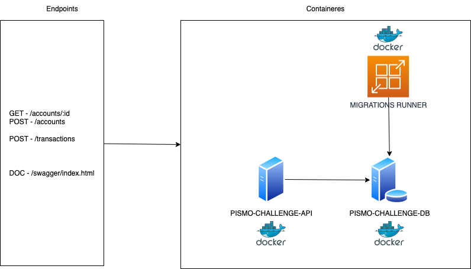

# Desafio PISMO

Esta é uma aplicação que faz parte do processo admissional da **PISMO**, nela iremos realizar a criação da conta do cliente e realizar transações na sua conta
Nela estaremos aplicando a arquitetura hexagonal proposta pelo Alistair Cockburn.
https://alistair.cockburn.us/hexagonal-architecture

# Como rodar o projeto?
**Antes de tudo, garanta que na sua máquina tenha o docker instalado.**

Segue as variaveis ambiente para rodar o projeto:
```
PG_HOST=
PG_PORT=
PG_USER=
PG_PASSWORD=
PG_DATABASE=
```

Para rodar o projeto basta executar o seguinte comando:
```bash
make run-dev
```
Caso deseje derrubar os conteineres levantandos pelo comando acima, basta executar o seguinte comando:
```bash
make stop-dev
```

# Documentação da API
A documentação da API foi feita usando o swagger, para acessar a documentação basta acessar, com a aplicação em execução, o seguinte link: http://localhost:8080/swagger/index.html

# Como rodar os testes?
Os comandos para execução de testes estão separados entre os testes unitários e os testes de integração.

Para rodar os testes unitários basta executar o seguinte comando:
```bash
make unit-test
```

Para rodar os testes de integração basta executar o seguinte comando:
```bash
make integration-test
```

# Desenho da arquitetura



# Tecnologias utilizadas
 - Banco de dados postgres
 - Golang
 - Docker

## Dependencias do Golang
- github.com/asaskevich/govalidator v0.0.0-20230301143203-a9d515a09cc2
- github.com/gin-gonic/gin v1.9.0
- github.com/golang/mock v1.6.0
- github.com/lib/pq v1.10.9
- github.com/mattn/go-sqlite3 v1.14.16
- github.com/stretchr/testify v1.8.2

# Distribuição das pastas
```
.
├── Dockerfile
├── Makefile
├── README.md
├── assets
│   ├── architecture.drawio
│   └── architecture.png
├── docker-compose.yml
├── docs
│   ├── docs.go
│   ├── swagger.json
│   └── swagger.yaml
├── go.mod
├── go.sum
├── migrations
│   ├── 20230515180138_create_account_table.sql
│   ├── 20230515180516_create_transaction_table.sql
│   └── 20230515180558_create_transaction_trigger.sql
├── pismo-challenge.postman_collection.json
└── src
    ├── adapters
    │   ├── primary
    │   │   └── http
    │   │       ├── account
    │   │       │   ├── api.go
    │   │       │   └── api_test.go
    │   │       └── transaction
    │   │           ├── api.go
    │   │           └── api_test.go
    │   └── secondary
    │       └── database
    │           ├── account
    │           │   ├── account.go
    │           │   └── account_test.go
    │           └── transaction
    │               ├── transaction.go
    │               └── transaction_test.go
    ├── application
    │   ├── dtos
    │   │   ├── account.go
    │   │   ├── error.go
    │   │   └── transaction.go
    │   ├── mocks
    │   │   ├── models
    │   │   │   ├── account.go
    │   │   │   └── transaction.go
    │   │   ├── ports
    │   │   │   ├── account.go
    │   │   │   └── transaction.go
    │   │   └── services
    │   │       ├── account.go
    │   │       └── transaction.go
    │   ├── models
    │   │   ├── account.go
    │   │   └── transaction.go
    │   ├── ports
    │   │   ├── account.go
    │   │   └── transaction.go
    │   └── services
    │       ├── account.go
    │       ├── account_test.go
    │       ├── transaction.go
    │       └── transaction_test.go
    └── cmd
        └── api
            └── main.go
```

# Ideias para melhoria da aplicação
- Implementar o pattern CQRS para separar as responsabilidades de leitura e escrita usando redis para cache
- Criar um serviço que realize de maneira mais efetiva o pagamento parcelado
- Criar um serviço de notificação para o cliente
- Criar o pattern saga para garantir a consistência das transações
  1. Criar serviço de compensação para caso ocorra falha na transação
- Melhorar as estruturas de dados que comportam as informações de amount da transação
  1. Retirar o ponto flutuante e utilizar inteiros não negativos (uint64) para maior precisão
  2. Utilizar o pattern decimal para maior precisão
- Realizar deploy em nuvem publica usando IaaC (Serverless Framework ou AWS SAM)
